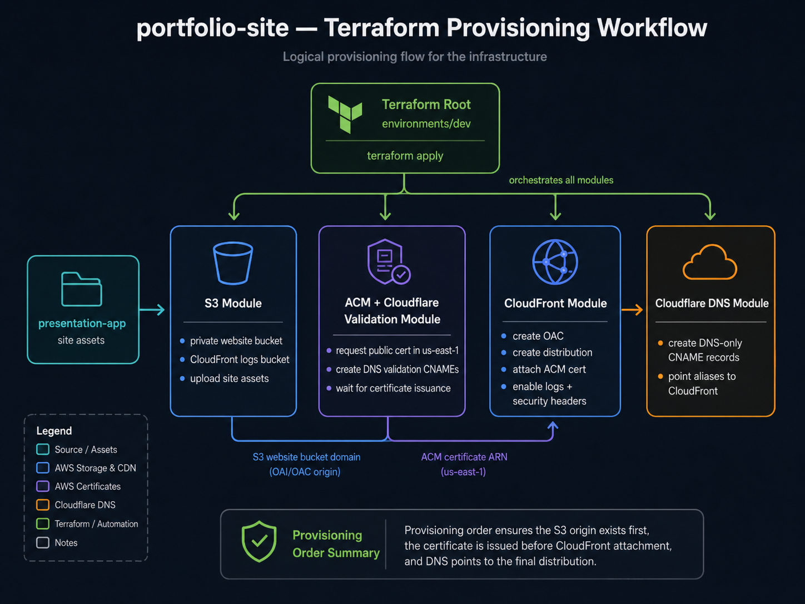
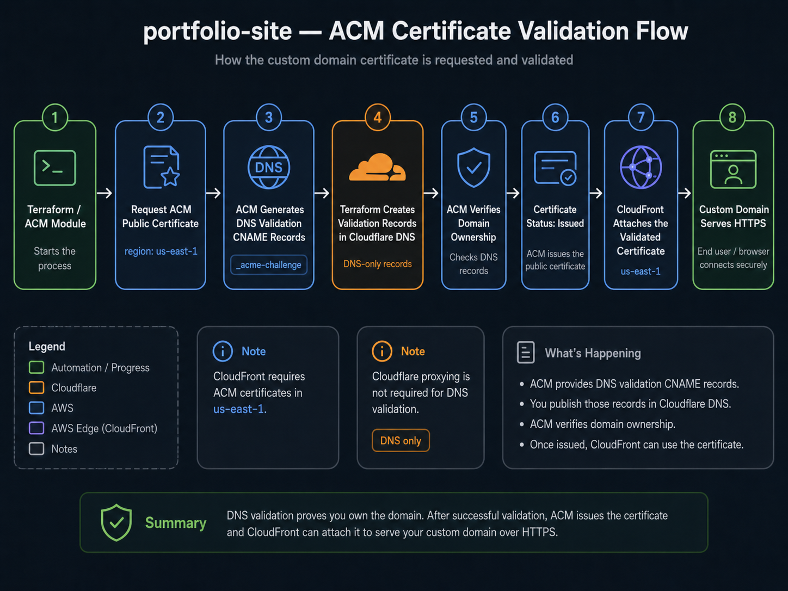

# Static Website Hosting

Terraform configuration for a private S3 static website served through CloudFront with Origin Access Control and Cloudflare DNS records.

## Architecture

- S3 stores the static website files and blocks public access.
- ACM creates a public certificate in `us-east-1` and validates it through Cloudflare DNS.
- CloudFront serves the website over HTTPS and signs origin requests with OAC.
- Cloudflare DNS creates DNS-only CNAME records for the configured domain names.
- GitHub Actions deploys the built frontend artifact to S3 and invalidates CloudFront.
- AWS access from GitHub Actions uses OIDC and IAM roles managed by Terraform.
- A dedicated S3 bucket stores CloudFront standard access logs.
- CloudWatch alarms monitor CloudFront 4xx and 5xx error rates.
- CloudFront maps 403 and 404 responses to `/index.html` for static frontend routing.

## What This Demonstrates

- Terraform module design for a realistic static website platform.
- Secure private-origin hosting with S3, CloudFront, and Origin Access Control.
- DNS and certificate automation across AWS ACM and Cloudflare.
- Remote Terraform state with native S3 lockfiles.
- CI/CD separation between infrastructure provisioning and frontend deployment.
- GitHub Actions OIDC authentication without long-lived AWS access keys.
- Pull request validation with Terraform plan, TFLint, and Checkov.
- Deployment controls with GitHub Environment approvals.
- Practical caching with content-hashed frontend assets.
- Basic operational visibility through CloudWatch alarms and CloudFront logs.

## Terraform Provisioning Workflow



## Usage

First bootstrap the Terraform remote backend:

```bash
cd terraform/bootstrap/backend
cp terraform.tfvars.example terraform.tfvars
terraform init
terraform plan
terraform apply
```

Then copy `terraform/environments/dev/terraform.tfvars.example` to `terraform/environments/dev/terraform.tfvars` and replace the example values.

## ACM Certificate Validation Flow



The ACM certificate used by CloudFront must be issued in `us-east-1`, even if the rest of the resources are deployed in another region.

Terraform uses an aliased AWS provider for `us-east-1` to create and validate the CloudFront certificate. The certificate is a standard non-exportable ACM public certificate, so there is no ACM certificate charge for this CloudFront use case.

```bash
cd terraform/environments/dev
terraform init \
  -backend-config="bucket=<state-bucket-name>" \
  -backend-config="key=static-website/dev/terraform.tfstate" \
  -backend-config="region=eu-central-1" \
  -backend-config="use_lockfile=true" \
  -backend-config="encrypt=true"
terraform fmt -recursive
terraform validate
terraform plan
terraform apply
```

## Remote State

The `dev` environment uses an S3 backend declared in `terraform/environments/dev/backend.tf`. Backend values are passed during `terraform init` so environment-specific bucket names are not hardcoded.

The backend resources are managed by the separate bootstrap stack in `terraform/bootstrap/backend`. The bootstrap stack itself uses local Terraform state after the first apply, because the remote backend cannot safely depend on the same bucket it creates. Keep that local bootstrap state private, or migrate/import the backend stack into a separately managed state location if you want fully remote management.

## DNS

DNS is managed in Cloudflare because the domain uses Cloudflare authoritative nameservers.

The Cloudflare module looks up the existing Cloudflare zone and creates DNS-only CNAME records pointing to the CloudFront distribution. Records are intentionally not proxied through Cloudflare, so CloudFront remains the CDN and TLS termination point for the website.

Cloudflare DNS is also used for ACM certificate validation records. Terraform creates the validation CNAME records automatically before attaching the validated certificate to CloudFront.

Authenticate the Cloudflare provider with an API token:

```bash
export CLOUDFLARE_API_TOKEN="..."
```

The token needs at least `Zone Read`, `DNS Read`, and `DNS Write` for the target zone.

In GitHub Actions, store this value as `CLOUDFLARE_API_TOKEN`. Cloudflare provider authentication still uses an API token; AWS OIDC does not authenticate to Cloudflare.

## CI/CD

CI/CD is documented separately in `ci-cd.md`.

The repository contains two workflows:

- `.github/workflows/terraform.yaml`
- `.github/workflows/deploy-frontend.yaml`

The Terraform workflow includes formatting, validation, TFLint, and Checkov scanning.

Pull requests also run `terraform plan` with AWS OIDC credentials so infrastructure changes can be reviewed before merge.

The frontend build emits deployable files in `portfolio-site/dist` and uses a content-hashed CSS filename so CloudFront/S3 can cache CSS aggressively while HTML remains easy to refresh.

The `apply` and frontend `deploy` jobs target the GitHub Environment named `dev`, so required reviewers can be configured from the repository settings. The first Terraform apply must be run with bootstrap credentials that can create IAM and OIDC resources. After that, GitHub Actions can assume the IAM roles created by Terraform.

Current CI/CD hardening:

- TFLint runs as a blocking Terraform lint check.
- Checkov runs as a Terraform security scan with `soft_fail: true` while findings are reviewed.
- GitHub Environment `dev` can enforce manual approval before Terraform apply or frontend deploy.
- Frontend CSS is content-hashed and deployed with long-lived immutable cache headers.
- HTML remains `no-cache` so releases can be picked up quickly.
- CloudWatch alarm notification actions are configurable, but default to disabled for the demo environment.

## Cost Estimate

This project is designed for low portfolio/demo traffic. Expected cost drivers:

- **S3 website bucket:** usually cents per month for small static assets.
- **S3 Terraform state bucket:** negligible storage cost, versioning can grow slowly over time.
- **CloudFront:** request and data transfer charges; usually low for portfolio traffic.
- **CloudFront logs bucket:** storage grows with traffic and log retention.
- **CloudWatch alarms:** billed per alarm; this project creates two CloudFront alarms.
- **ACM public certificate:** no additional charge when used with CloudFront.
- **Cloudflare DNS:** depends on the Cloudflare plan; DNS-only records can fit the free tier.

Review current AWS and Cloudflare pricing before running long-lived deployments.

## Known Limitations And Trade-Offs

- The backend bootstrap stack keeps local state by default after creating the state bucket.
- Checkov runs with `soft_fail: true` until findings are reviewed and either fixed or explicitly accepted.
- CloudWatch alarms are created with optional notification actions; no SNS topic is provisioned by default.
- The S3 bucket policy allows CloudFront distributions from the same AWS account instead of one exact distribution ARN to avoid a Terraform dependency cycle.
- CloudFront maps 403 and 404 responses to `/index.html`, which supports frontend routing but can mask real missing-page responses.
- This is a single-environment `dev` setup, not a multi-account production deployment.
- Cloudflare is used as DNS only; proxying is disabled so CloudFront remains the CDN and TLS endpoint.
- The Terraform apply role is intentionally broader than ideal production least privilege to keep the portfolio stack maintainable.

## Security Notes

The S3 website bucket is private and only grants read access to CloudFront service principals from the current AWS account. An exact distribution ARN condition would create a Terraform dependency cycle when the policy is owned by the S3 module, so the module uses an account-scoped CloudFront distribution ARN pattern.

Terraform does not manage website objects. Application deployment is intentionally handled by the frontend workflow so infrastructure state does not churn on every frontend change.

CloudFront security response headers are enabled, including HSTS, frame protection, content type sniffing protection, and a restrictive referrer policy.

`X-XSS-Protection` is intentionally not configured because modern browsers have deprecated or removed legacy XSS auditor behavior.
