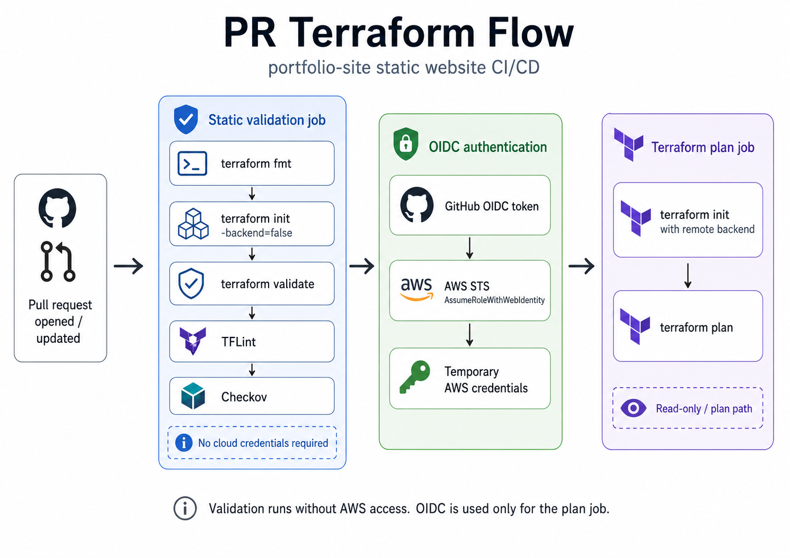
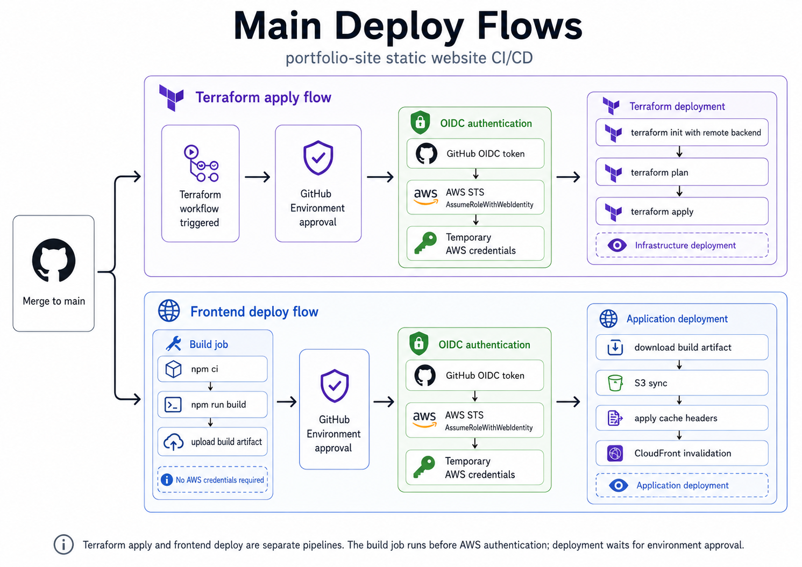

# CI/CD Documentation

This repository separates infrastructure delivery from application delivery.

- Terraform provisions the AWS and Cloudflare infrastructure.
- The frontend workflow builds the static website and publishes the deployable files to S3.
- GitHub Actions authenticates to AWS through OIDC, without long-lived AWS access keys.
- Cloudflare authentication uses a zone-scoped API token stored as a GitHub secret.

## Overview

The project uses two independent delivery paths:

1. **Infrastructure delivery** through Terraform and GitHub Actions.
2. **Frontend delivery** through a static build, S3 upload, and CloudFront invalidation.

Terraform owns the infrastructure layer: S3 bucket, CloudFront distribution, IAM roles, GitHub OIDC trust, Cloudflare DNS records, monitoring resources, and Terraform backend permissions.

The frontend workflow owns only the deployable website objects inside the S3 website bucket. Terraform does not manage the built HTML, CSS, JavaScript, image, or font files.

## Workflows

### Terraform Workflow

Workflow file:

```text
.github/workflows/terraform.yaml
```



Triggers:

- Pull requests that change `terraform/**` or the workflow file.
- Pushes to `main` that change `terraform/**` or the workflow file.
- Manual `workflow_dispatch` runs.

Jobs:

- `validate`: runs formatting, validation, linting, and security checks without cloud credentials.
- `plan`: runs on pull requests, assumes the Terraform plan IAM role through AWS OIDC, initializes the remote backend, and runs `terraform plan`.
- `apply`: runs on `main` or manual dispatch, assumes the Terraform apply IAM role through AWS OIDC, runs `terraform plan`, then `terraform apply`.

The pull request path has two stages:

1. The `validate` job avoids cloud credentials and catches static issues early.
2. The `plan` job uses OIDC-based temporary AWS credentials and the Cloudflare API token to show proposed infrastructure changes without applying them.

TFLint is configured in `.tflint.hcl` and blocks the workflow on warnings or errors. Checkov scans the Terraform code and reports security findings, but currently uses `soft_fail: true` so the scan does not block CI until the expected demo-project exceptions are reviewed and documented.

Current Terraform quality gates:

- `terraform fmt -check -recursive`
- `terraform init -backend=false`
- `terraform validate`
- `tflint --recursive --minimum-failure-severity=warning`
- Checkov Terraform scan with `soft_fail: true`

Local pre-commit checks are also available through `.pre-commit-config.yaml`:

```bash
pre-commit install
pre-commit run --all-files
```

Before disabling Checkov `soft_fail`, each finding should either be fixed or documented with a specific skipped check and justification.

### Frontend Deploy Workflow

Workflow file:

```text
.github/workflows/deploy-frontend.yaml
```




Triggers:

- Pull requests that change `portfolio-site/**` or the workflow file. These run the build job only.
- Pushes to `main` that change `portfolio-site/**` or the workflow file.
- Manual `workflow_dispatch` runs.

Jobs:

- `build`: installs dependencies, runs the static site build, prepares a clean deploy directory, and uploads it as a GitHub Actions artifact.
- `deploy`: runs only for `main` pushes or manual dispatches, downloads the build artifact, assumes the frontend deploy IAM role through AWS OIDC, syncs files to S3, applies cache headers, and creates a CloudFront invalidation.

The GitHub Actions artifact is only an internal CI artifact. The S3 bucket stores the extracted static files, not a zip file, because CloudFront serves the HTML, CSS, JavaScript, images, fonts, and other assets directly from S3.

The frontend build creates:

```text
portfolio-site/dist
```

Generated static assets should use content-hashed filenames where possible, for example:

```text
assets/styles.1a2b3c4d5e6f.css
assets/app.7f3a91c2.js
```

HTML files should reference the latest hashed assets.

The deploy job applies cache headers based on asset type:

- HTML: `no-cache`
- Content-hashed assets: `public, max-age=31536000, immutable`
- Other static assets: `public, max-age=3600`

This keeps HTML easy to refresh while allowing content-hashed CSS, JavaScript, images, and fonts to be cached aggressively.

The workflow currently invalidates CloudFront with:

```text
/*
```

This is acceptable for a small portfolio site. For larger projects, targeted invalidations for changed HTML files would be more efficient.

## AWS OIDC Flow

Terraform creates the AWS side of the trust relationship:

- `aws_iam_openid_connect_provider` for `https://token.actions.githubusercontent.com`.
- Frontend deploy IAM role for S3 object deployment and CloudFront invalidation.
- Terraform plan IAM role for pull request plans.
- Terraform apply IAM role for infrastructure changes.

The GitHub workflows use:

```yaml
permissions:
  contents: read
  id-token: write
```

and configure AWS credentials with:

```yaml
- uses: aws-actions/configure-aws-credentials@v4
  with:
    role-to-assume: ${{ vars.AWS_FRONTEND_DEPLOY_ROLE_ARN }}
    aws-region: ${{ env.AWS_REGION }}
```

At runtime:

1. GitHub Actions requests an OIDC token for the current job.
2. `aws-actions/configure-aws-credentials` sends that token to AWS STS.
3. AWS STS evaluates the IAM role trust policy.
4. If the token matches the allowed repository, branch or pull request context, and audience, AWS returns temporary credentials.
5. The remaining workflow steps use those temporary credentials.

Terraform does not request a token from GitHub. Terraform creates the AWS IAM objects that allow GitHub Actions to exchange a GitHub-issued OIDC token for temporary AWS credentials.

Deployment roles are restricted to the `main` branch subject:

```text
repo:<owner>/<repo>:ref:refs/heads/main
```

The Terraform plan role also allows the pull request subject so PR plans can run:

```text
repo:<owner>/<repo>:pull_request
```

All GitHub Actions IAM roles require the expected audience:

```text
sts.amazonaws.com
```

The plan role should have enough read permissions to evaluate the current state and proposed changes, but it should not be able to mutate infrastructure. In practice, Terraform plan permissions can still be fairly broad because providers often need many read and list actions.

## Bootstrap Requirement

The first Terraform apply cannot use the GitHub Actions IAM roles because those roles do not exist yet.

The remote backend must also exist before the main `dev` stack can use it. This repository includes a separate bootstrap stack for that purpose:

```text
terraform/bootstrap/backend
```

Bootstrap the backend once from a local machine or an existing admin/deployment identity:

```bash
cd terraform/bootstrap/backend
cp terraform.tfvars.example terraform.tfvars
terraform init
terraform plan
terraform apply
```

This creates:

- An encrypted S3 bucket for Terraform state.
- S3 bucket versioning for state recovery.
- Public access blocking.
- Bucket-owner-enforced object ownership.
- A DynamoDB table for Terraform state locking.

The bootstrap stack keeps local Terraform state by default after the first apply. This is intentional because the remote backend bucket does not exist before the bootstrap run.

Keep the local bootstrap state private. If remote management of the bootstrap resources is desired later, migrate or import those resources into a separate remote state location.

Then initialize the main `dev` stack with the remote backend:

```bash
cd terraform/environments/dev
terraform init \
  -backend-config="bucket=<state-bucket-name>" \
  -backend-config="key=static-website/dev/terraform.tfstate" \
  -backend-config="region=eu-central-1" \
  -backend-config="dynamodb_table=<lock-table-name>" \
  -backend-config="encrypt=true"
terraform plan
terraform apply
```

The bootstrap identity needs permission to create the backend resources and the infrastructure in the main stack, including IAM roles and the GitHub OIDC provider.

After the first successful apply, configure the GitHub repository or environment variables with the Terraform outputs:

```bash
terraform output bucket_name
terraform output cloudfront_distribution_id
terraform output github_actions_frontend_role_arn
terraform output github_actions_terraform_plan_role_arn
terraform output github_actions_terraform_role_arn
```

After that, future Terraform and frontend deployments can run from GitHub Actions.

## Required GitHub Repository Setup

Before relying on GitHub Actions for deployments:

1. Create the `dev` GitHub Environment.
2. Add the required repository or environment variables.
3. Add the `CLOUDFLARE_API_TOKEN` secret.
4. Enable required reviewers if manual approval is desired.
5. Run the backend bootstrap stack locally or from an existing admin/deployment identity.
6. Run the first main Terraform apply locally or from an existing admin/deployment identity.
7. Copy the relevant Terraform outputs into GitHub variables.
8. Run a pull request to verify `validate` and `plan`.
9. Merge to `main` to verify `apply` and frontend deployment.

## GitHub Variables

Repository or environment variables used by the workflows:

| Variable | Used by | Description |
| --- | --- | --- |
| `AWS_REGION` | Terraform, Frontend | AWS region for regional resources, for example `eu-central-1`. |
| `AWS_TERRAFORM_ROLE_ARN` | Terraform | IAM role ARN assumed by the Terraform apply workflow. |
| `AWS_TERRAFORM_PLAN_ROLE_ARN` | Terraform | Limited IAM role ARN assumed by pull request Terraform plan jobs. |
| `AWS_FRONTEND_DEPLOY_ROLE_ARN` | Frontend | IAM role ARN assumed by the frontend deploy workflow. |
| `TF_STATE_BUCKET` | Terraform | S3 bucket used by the Terraform backend. |
| `TF_STATE_KEY` | Terraform | State object key, for example `static-website/dev/terraform.tfstate`. |
| `TF_LOCK_TABLE` | Terraform | DynamoDB table used for Terraform state locking. |
| `TF_PROJECT` | Terraform | Terraform `project` variable. |
| `TF_BUCKET_NAME` | Terraform | Terraform `bucket_name` variable. |
| `CLOUDFLARE_ZONE_NAME` | Terraform | Cloudflare zone name. |
| `DOMAIN_ALIASES_JSON` | Terraform | JSON list of CloudFront domain aliases, for example `["example.com", "www.example.com"]`. |
| `S3_BUCKET_NAME` | Frontend | Website bucket name from Terraform output `bucket_name`. |
| `CLOUDFRONT_DISTRIBUTION_ID` | Frontend | CloudFront distribution ID from Terraform output `cloudfront_distribution_id`. |
| `WEBSITE_URL` | Frontend | Optional deployment URL shown on the GitHub Environment deployment page. |

`DOMAIN_ALIASES_JSON` should include all CloudFront alternate domain names. Each alias must also be covered by the ACM certificate used by CloudFront.

The workflows currently target the `dev` environment and `main` branch.

## GitHub Environment Protection

Both deployment jobs target the GitHub Environment named `dev`:

- Terraform workflow: `apply` job.
- Frontend workflow: `deploy` job.

The environment reference is defined directly in the workflow YAML:

```yaml
environment:
  name: dev
```

For the frontend deployment, the environment can also show the live site URL:

```yaml
environment:
  name: dev
  url: ${{ vars.WEBSITE_URL }}
```

Configure the environment in GitHub:

1. Open the repository in GitHub.
2. Go to `Settings` -> `Environments`.
3. Create an environment named `dev`.
4. Enable `Required reviewers`.
5. Add yourself or the intended reviewer account/team.
6. Optionally enable a wait timer for deploys.
7. Add environment-scoped variables and secrets if deployment values should be available only after approval.

Recommended environment-scoped values for `dev`:

- `AWS_TERRAFORM_ROLE_ARN`
- `AWS_TERRAFORM_PLAN_ROLE_ARN`
- `AWS_FRONTEND_DEPLOY_ROLE_ARN`
- `TF_STATE_BUCKET`
- `TF_STATE_KEY`
- `TF_LOCK_TABLE`
- `S3_BUCKET_NAME`
- `CLOUDFRONT_DISTRIBUTION_ID`
- `WEBSITE_URL`
- `CLOUDFLARE_API_TOKEN`

With required reviewers enabled, GitHub pauses the `apply` and `deploy` jobs before any cloud credentials are requested. Validation, linting, and security scan steps still run without approval.

## GitHub Secrets

| Secret | Used by | Description |
| --- | --- | --- |
| `CLOUDFLARE_API_TOKEN` | Terraform | API token used by the Cloudflare provider. |

The Cloudflare token should be scoped to the target zone, not the entire account, and needs only:

- `Zone Read`
- `DNS Read`
- `DNS Write`

AWS credentials should not be stored as GitHub secrets. AWS access is provided by OIDC and temporary STS credentials.

## Terraform State

The main `dev` stack has an active S3 backend declaration in:

```text
terraform/environments/dev/backend.tf
```

The backend configuration values are intentionally not hardcoded in the Terraform block. Local commands and GitHub Actions pass them during `terraform init` with `-backend-config`.

In GitHub Actions, the Terraform workflow runs:

```bash
terraform init \
  -backend-config="bucket=${TF_STATE_BUCKET}" \
  -backend-config="key=${TF_STATE_KEY}" \
  -backend-config="region=${AWS_REGION}" \
  -backend-config="dynamodb_table=${TF_LOCK_TABLE}" \
  -backend-config="encrypt=true"
```

The Terraform IAM role also receives S3 and DynamoDB permissions for this backend, based on the `TF_STATE_BUCKET` and `TF_LOCK_TABLE` values passed into the stack as Terraform variables.

## DNS, TLS, and CloudFront Notes

Cloudflare is used as the DNS provider. Proxying is intentionally disabled so traffic goes directly from the browser to CloudFront instead of passing through both Cloudflare and CloudFront.

CloudFront custom domain aliases must have matching DNS records in Cloudflare and must be covered by the ACM certificate attached to the CloudFront distribution.

CloudFront requires ACM certificates to be created in `us-east-1`, regardless of the AWS region used for the S3 bucket, Terraform backend, or other regional resources.

Recommended DNS behavior:

- Keep Cloudflare records as DNS-only.
- Point the apex/root domain to CloudFront using the appropriate Cloudflare-supported record type.
- Point `www` or other subdomains to the CloudFront distribution as needed.
- Include every public hostname in `DOMAIN_ALIASES_JSON`.
- Include every public hostname in the ACM certificate subject alternative names.

## Frontend Deployment Details

Terraform owns the S3 bucket and CloudFront distribution. It does not manage website objects.

The frontend workflow:

1. Runs `npm ci` in `portfolio-site`.
2. Runs `npm run build`.
3. Generates deployable files in `portfolio-site/dist`.
4. Writes built assets with content hashes where possible.
5. Ensures HTML files reference the latest hashed assets.
6. Uploads `portfolio-site/dist` as a GitHub Actions artifact.
7. Syncs the artifact contents to S3 with `aws s3 sync --delete`.
8. Applies long-term immutable cache headers to content-hashed assets.
9. Applies `Cache-Control: no-cache` to HTML files.
10. Invalidates CloudFront with `/*`.

Current cache behavior:

- HTML: `no-cache`
- Content-hashed assets: `public, max-age=31536000, immutable`
- Other static assets: `public, max-age=3600`

The website bucket should be treated as CI-owned. Manual files placed in the bucket may be removed by `aws s3 sync --delete`.

## Monitoring and Error Handling

Terraform creates CloudWatch alarms for the CloudFront distribution:

- 4xx error rate above the configured threshold.
- 5xx error rate above the configured threshold.

The alarms use:

```hcl
treat_missing_data = "notBreaching"
```

This fits a low-traffic portfolio project because periods with no requests should not create false alarms.

Alarm notifications are optional. Configure `cloudwatch_alarm_actions` and `cloudwatch_ok_actions` with SNS topic ARNs or other supported CloudWatch alarm action ARNs if notifications are required. They default to empty lists, so alarms are created without notification targets unless explicitly configured.

CloudFront maps 403 and 404 origin responses to `/index.html` with HTTP 200. This supports static frontend routing and handles the fact that private S3 origins often return 403 rather than 404 for missing objects.

This behavior is useful for single-page applications, but it can mask true 404 responses. If the project later needs real missing-page semantics, revisit the custom error response configuration.

## Operational Notes

- Use GitHub Environments for `dev` if manual approval is required before `terraform apply` or frontend deployment.
- Keep the Terraform apply role broader than the frontend role, but restrict its trust policy to the repository and deployment branch.
- Keep the Terraform plan role non-mutating where practical.
- Keep the frontend role narrow: S3 access only to the website bucket and CloudFront invalidation only for the target distribution.
- Bootstrap the remote backend before enabling automatic Terraform applies from GitHub Actions.
- Treat the website bucket as CI-owned because deployment uses `aws s3 sync --delete`.
- Review Checkov findings before turning `soft_fail` off.
- If a Checkov finding is intentionally accepted for the portfolio scope, document the reason and skip only that specific check.
- If the project later adds staging or production, create separate environments, state keys, IAM roles, and GitHub Environment protections.

## Known Limitations and Intentional Trade-Offs

- The backend bootstrap stack keeps local state unless it is later migrated or imported into a separate remote backend.
- The repository targets one `dev` environment and does not implement multi-account production isolation.
- The Terraform apply role is broader than a production-hardened least-privilege role.
- The PR plan role and frontend deploy role are intentionally narrower than the apply role.
- Checkov is non-blocking until findings are reviewed and documented.
- CloudWatch alarm notifications are optional and disabled by default.
- CloudFront custom error responses support frontend routing but can mask true 404 responses.
- Cloudflare is DNS-only; proxying is intentionally disabled to avoid two CDN, cache, and TLS layers.
- CloudFront invalidates `/*` for simplicity, which is acceptable for a small portfolio site but less efficient for larger deployments.
