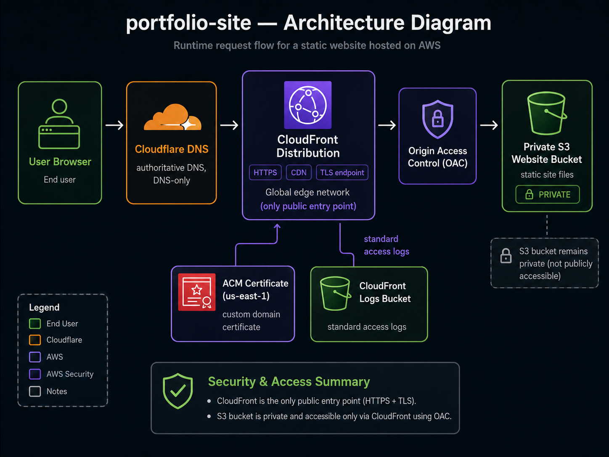

# Infrastructure Documentation

## Overview

This repository provisions infrastructure for hosting a static website on AWS. The website files are stored in a private S3 bucket and delivered globally through CloudFront. Cloudflare DNS is used to create DNS records for the configured domain names.

The design keeps the S3 bucket private and uses CloudFront Origin Access Control to allow CloudFront to read objects from S3.

## Architecture

Request flow:

1. A user visits one of the configured domain aliases.
2. Cloudflare DNS resolves the domain to the CloudFront distribution.
3. CloudFront serves cached content when available.
4. On a cache miss, CloudFront signs the origin request with OAC.
5. S3 returns the static object only to authorized CloudFront requests.

Main components:

- `terraform/environments/dev`: environment-level Terraform configuration.
- `terraform/bootstrap/backend`: bootstrap stack for the Terraform remote state bucket and lock table.
- `modules/s3`: website bucket, CloudFront log bucket, encryption, versioning, lifecycle rules, and bucket policy.
- `modules/acm-cloudflare`: ACM public certificate in `us-east-1` with DNS validation records in Cloudflare.
- `modules/cloudfront`: CloudFront distribution, OAC, managed cache policy, TLS configuration, logging, and security response headers.
- `modules/cloudflare-dns`: DNS-only Cloudflare CNAME records pointing to CloudFront.
- `modules/github-actions-iam`: GitHub Actions OIDC provider and IAM roles for Terraform and frontend deployment workflows.
- `portfolio-site`: static website source files built by GitHub Actions and deployed to S3.

# Architecture Diagram



## S3

The S3 module creates two buckets:

- Website bucket: stores the static site files.
- CloudFront logs bucket: stores CloudFront standard access logs.

The website bucket:

- Blocks public access.
- Uses bucket-owner-enforced object ownership.
- Enables server-side encryption with `AES256`.
- Enables versioning.
- Expires noncurrent object versions after the configured retention period.

The S3 module does not upload website files. Terraform owns the bucket and access controls only; the frontend deployment workflow builds the site, creates a CI artifact, syncs the deployable files to S3, and invalidates CloudFront.

The frontend build writes deployable files to `portfolio-site/dist`. The generated CSS filename includes a content hash, and the generated HTML files reference that hashed CSS asset.

HTML files deployed by GitHub Actions use:

```hcl
cache_control = "no-cache"
```

Content-hashed CSS files deployed by GitHub Actions use:

```hcl
cache_control = "public, max-age=31536000, immutable"
```

Other static files deployed by GitHub Actions use:

```hcl
cache_control = "public, max-age=3600"
```

This avoids serving stale HTML while allowing hashed CSS assets to be cached aggressively.

## GitHub Actions IAM

The `github-actions-iam` module creates:

- A GitHub Actions OIDC provider for `https://token.actions.githubusercontent.com`.
- A frontend deployment role that can sync objects to the website bucket and create CloudFront invalidations.
- A Terraform role for managing this infrastructure stack from CI.

Both roles trust only tokens from the configured `github_repository` and `github_deploy_branch`. The workflows use `aws-actions/configure-aws-credentials` with `id-token: write`, so no long-lived AWS access keys are stored in GitHub.

The first Terraform apply must be run with bootstrap credentials that are allowed to create IAM roles and the OIDC provider. After the roles exist, GitHub Actions can assume them.

## CloudFront

CloudFront is configured as the public entry point for the website.

Key settings:

- HTTPS redirect for viewer requests.
- IPv6 enabled.
- S3 origin protected with Origin Access Control.
- ACM certificate support for custom aliases.
- Managed `CachingOptimized` cache policy.
- Standard access logging to the S3 log bucket.
- Security response headers policy.
- Custom 403 and 404 responses routed to `/index.html` with HTTP 200.

The security headers policy enables:

- `Strict-Transport-Security`
- `X-Content-Type-Options`
- `X-Frame-Options`
- `Referrer-Policy`

`X-XSS-Protection` is intentionally omitted because modern browsers have deprecated or removed legacy XSS auditor behavior.

The ACM certificate used by CloudFront must be issued in `us-east-1`.

Custom error responses are configured because S3 private origins commonly return 403 for missing objects. Returning `/index.html` for 403 and 404 keeps direct navigation and refreshes working for frontend routes while the site remains hosted from a private S3 origin.

## ACM Certificate

CloudFront requires ACM certificates to exist in `us-east-1`. The environment keeps the default AWS provider in the configured regional deployment region and adds an aliased provider for certificate management:

```hcl
provider "aws" {
  alias  = "us_east_1"
  region = "us-east-1"
}
```

The ACM module:

- Creates a public ACM certificate in `us-east-1`.
- Uses the first `domain_aliases` entry as the primary certificate domain.
- Uses the remaining `domain_aliases` entries as Subject Alternative Names.
- Creates DNS validation CNAME records in Cloudflare.
- Waits for ACM certificate validation.
- Exposes the validated certificate ARN to CloudFront.

The certificate is a standard non-exportable ACM public certificate for use with AWS services. This avoids ACM exportable certificate charges.

## S3 Bucket Policy

The S3 module owns the website bucket policy. It allows the CloudFront service principal to read objects only when the request comes from a CloudFront distribution in the same AWS account.

The policy uses an account-scoped CloudFront distribution ARN pattern:

```hcl
arn:aws:cloudfront::<account-id>:distribution/*
```

This avoids a Terraform dependency cycle. An exact distribution ARN condition would require the S3 module to depend on CloudFront, while CloudFront already depends on the S3 bucket origin.

For stricter production deployments, consider moving the bucket policy back to the root module or introducing a second apply step so the policy can reference the exact CloudFront distribution ARN.

## Cloudflare DNS

The Cloudflare DNS module creates CNAME records pointing to CloudFront.

The module:

- Looks up the existing Cloudflare zone by name.
- Creates one DNS record for each configured domain alias.
- Uses `proxied = false`, so Cloudflare acts only as authoritative DNS.
- Points each record at the CloudFront distribution domain name.

The ACM module also creates Cloudflare DNS records for certificate validation. Those records are separate from the user-facing website CNAME records.

Cloudflare proxying is intentionally disabled. CloudFront remains the CDN, cache layer, and TLS endpoint for the website. Enabling Cloudflare proxying in front of CloudFront would introduce a second proxy/CDN layer and make caching, headers, TLS, and troubleshooting more complex.

Authentication uses a Cloudflare API token exposed through:

```bash
export CLOUDFLARE_API_TOKEN="..."
```

The token should be scoped to the target zone and needs at least:

- `Zone Read`
- `DNS Read`
- `DNS Write`

GitHub Actions receives this value through the `CLOUDFLARE_API_TOKEN` repository or environment secret. Cloudflare is not authenticated through AWS OIDC.

## Variables

Environment variables are defined in:

```text
terraform/environments/dev/variables.tf
```

Real values should be provided through:

```text
terraform/environments/dev/terraform.tfvars
```

Do not commit real `.tfvars` files. Use:

```text
terraform/environments/dev/terraform.tfvars.example
```

as the public template.

## Remote State

The `dev` environment uses an S3 backend declared in:

```text
terraform/environments/dev/backend.tf
```

The backend resources are managed separately in:

```text
terraform/bootstrap/backend
```

The bootstrap stack creates:

- S3 bucket for Terraform state.
- Encryption enabled.
- S3 bucket versioning.
- Public access blocking.

Bootstrap it once:

```bash
cd terraform/bootstrap/backend
cp terraform.tfvars.example terraform.tfvars
terraform init
terraform plan
terraform apply
```

The bootstrap backend stack itself keeps local Terraform state by default after the first apply. This is intentional: the remote backend bucket cannot be used before it exists. Keep the bootstrap state private, or migrate/import the backend stack into a separate remote state location if you want the backend resources to be managed remotely as well.

## Deployment

From the dev environment:

```bash
cd terraform/environments/dev
terraform init \
  -backend-config="bucket=<state-bucket-name>" \
  -backend-config="key=static-website/dev/terraform.tfstate" \
  -backend-config="region=eu-central-1" \
  -backend-config="use_lockfile=true" \
  -backend-config="encrypt=true"
terraform fmt -recursive
terraform validate
terraform plan
terraform apply
```

After Terraform has created the bucket, CloudFront distribution, and GitHub Actions IAM roles, the frontend workflow deploys the application from `portfolio-site` to S3.

CI/CD configuration, required GitHub variables, secrets, and the AWS OIDC flow are documented in `ci-cd.md`.

## Validation

Recommended local checks:

```bash
terraform fmt -check -recursive
terraform validate
terraform plan
```

Recommended CI checks:

- `terraform fmt -check -recursive`
- `terraform validate`
- `tflint`
- `checkov`

The repository also includes `.pre-commit-config.yaml` for local Terraform formatting, validation, TFLint, and Checkov checks before changes reach CI.

The Terraform CI workflow currently runs TFLint as a blocking check and Checkov as a non-blocking security scan with `soft_fail: true`. This allows security findings to be reviewed and either fixed or explicitly documented before making Checkov blocking.

Pull requests also run `terraform plan` using GitHub OIDC and the Terraform IAM role. The plan job reads remote state and cloud APIs but does not apply changes.

The pull request plan job should use `AWS_TERRAFORM_PLAN_ROLE_ARN`, a separate limited IAM role from the apply role. The apply role remains scoped to the deployment branch and should be protected by the GitHub Environment approval.

Deployment jobs target the GitHub Environment named `dev`. Required reviewers can be configured in GitHub so Terraform apply and frontend deploy wait for manual approval before cloud credentials are requested.

## Reliability

Current reliability features:

- S3 versioning for website objects.
- Lifecycle cleanup for old object versions.
- Lifecycle cleanup for CloudFront logs.
- CloudFront caching.
- Private S3 origin access through CloudFront.
- GitHub Actions OIDC authentication for AWS deployments.
- CloudWatch alarms for CloudFront 4xx and 5xx error rates.
- CloudFront custom 403/404 responses for static frontend routing.

Potential future improvements:

- S3 access logging or CloudTrail data events if deeper auditability is needed.

CloudWatch alarm actions are optional and can be configured through `cloudwatch_alarm_actions` and `cloudwatch_ok_actions`. By default, alarms are created without notification targets.

## Security

Current security features:

- S3 public access blocked.
- S3 bucket ownership enforced for website content.
- Server-side encryption enabled.
- ACM certificate managed in `us-east-1` and validated through Cloudflare DNS.
- CloudFront OAC protects the origin.
- HTTPS enforced at CloudFront.
- TLS minimum protocol version configured.
- Security response headers enabled.
- GitHub Actions uses AWS OIDC instead of static AWS access keys.
- Real `.tfvars` files ignored by Git.

Security trade-off:

- The S3 read policy is scoped to CloudFront distributions in the same AWS account, not a single distribution ARN, to keep module ownership simple and avoid dependency cycles.

## Known Limitations And Intentional Trade-Offs

- The backend bootstrap stack uses local state unless you later migrate/import it elsewhere.
- The project models one `dev` environment rather than full multi-account production separation.
- The Terraform apply IAM role is broader than a hardened production role, while the PR plan and frontend deploy roles are narrower.
- Checkov currently reports findings without failing CI so findings can be reviewed before making the scan blocking.
- CloudWatch alarms default to no notification targets unless `cloudwatch_alarm_actions` is configured.
- CloudFront custom 403/404 responses return `/index.html` with HTTP 200, which is useful for frontend routing but can hide real missing-page responses.
- The S3 read policy allows same-account CloudFront distributions rather than a single distribution ARN to avoid a Terraform dependency cycle.
- Cloudflare proxying is disabled intentionally so there is only one CDN/TLS/caching layer: CloudFront.

## Cost Notes

Expected cost drivers:

- CloudFront data transfer and request volume.
- S3 storage for website files.
- S3 storage for Terraform state versions.
- CloudWatch alarm monthly charges.
- S3 storage for CloudFront logs.
- Cloudflare plan or DNS features, depending on account settings.

For a portfolio/demo project, the footprint should be small, but CloudFront traffic and log storage are not free.

## Teardown

To destroy the environment:

```bash
cd terraform/environments/dev
terraform destroy
```

If S3 buckets contain retained object versions or logs, deletion may require lifecycle cleanup to complete first or manual removal of remaining objects.
